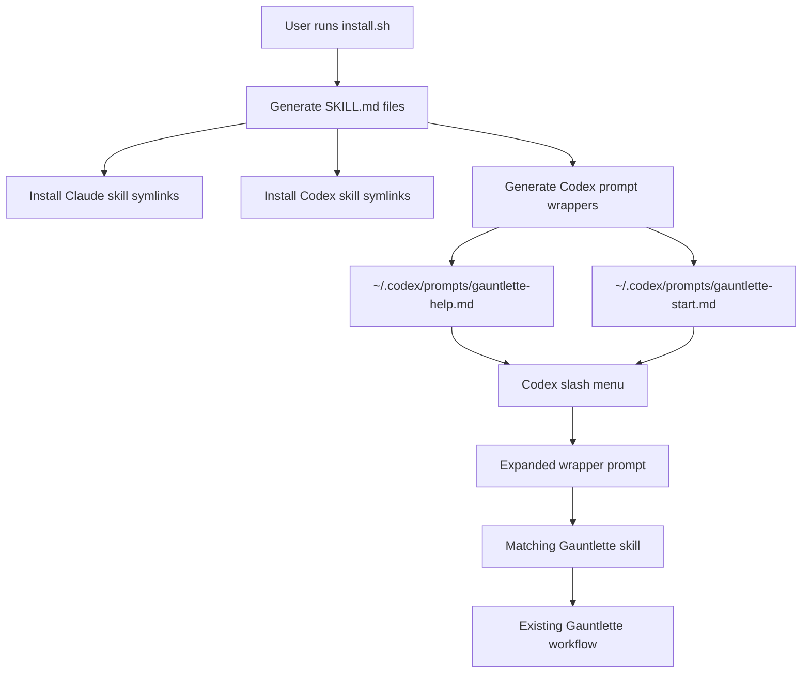
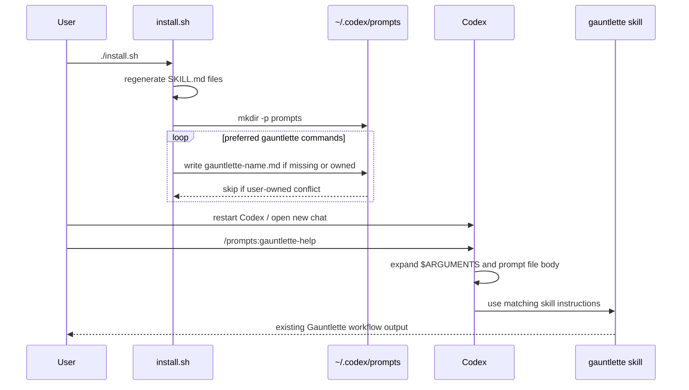

# Codex Slash Command Compatibility for Gauntlette

Created by /gauntlette-start on 2026-05-30
Branch: slash-command-bridge | Repo: gauntlette
Design doc: /Users/robertkarl/.gauntlette/designs/gauntlette/slash-command-bridge-design-20260530-162913.md

## Problem Statement

Gauntlette presents itself as a slash-command workflow. Claude Code already makes installed Gauntlette skills appear as `/gauntlette-*` commands, but Codex did not resolve `/gauntlette-help` the same way in this session. That breaks the command muscle memory the README teaches and makes Codex feel like a second-class target.

The chosen wedge uses Codex custom prompts as a compatibility layer. OpenAI marks custom prompts deprecated in favor of skills, but still documents them as local Markdown files that can be invoked as slash commands in Codex CLI and IDE. Gauntlette will keep skills as the source of truth and generate only thin prompt wrappers.

## Vision

After install, a Codex user can type `/prompts:gauntlette-help` or search for `gauntlette-help` in the slash menu, then send a wrapper that tells Codex to use the matching Gauntlette skill. This is not exact Claude Code parity. It is the supported Codex custom-prompt path, and the docs must say that plainly.

## Planning Mode

BUILDER - This is a tooling and workflow improvement for a local developer pipeline. The interview optimized for a satisfying command surface and a small shippable compatibility layer, not a customer discovery process.

## Feature Spec

Add Codex prompt-wrapper installation for the preferred Gauntlette command list:

- `/gauntlette-help`
- `/gauntlette-start`
- `/gauntlette-ceo-review`
- `/gauntlette-design-review`
- `/gauntlette-eng-review`
- `/gauntlette-fresh-eyes`
- `/gauntlette-cso-review`
- `/gauntlette-implement`
- `/gauntlette-code-review`
- `/gauntlette-quality-check`
- `/gauntlette-human-review`
- `/gauntlette-ship-it`

For each preferred command, `install.sh` should generate a top-level Markdown file at `${CODEX_HOME:-$HOME/.codex}/prompts/{command-without-leading-slash}.md`. Codex custom prompts do not scan subdirectories. Each file should include:

- YAML frontmatter with `description:` copied or summarized from the skill's purpose.
- Optional `argument-hint:` so plan paths or free-form arguments can be passed.
- A Gauntlette ownership marker comment.
- A short prompt body that says to use the matching Gauntlette skill and pass `$ARGUMENTS` as context.

Example shape:

```markdown
---
description: Show preferred gauntlette commands, pipeline order, and current plan status.
argument-hint: [ARGUMENTS]
---

<!-- Generated by gauntlette install.sh. Do not edit directly. -->

Use the `gauntlette-help` skill now. Treat this as the Codex compatibility wrapper for `/prompts:gauntlette-help`.
If arguments were supplied, preserve them as request context: $ARGUMENTS.
Follow the skill's instructions exactly.
```

`uninstall.sh` should remove only generated prompt files with the Gauntlette ownership marker. User-owned files with the same names must be skipped.

## Scope

| Item | Decision | Effort | Why |
|------|----------|--------|-----|
| Generate preferred Codex prompt wrappers | ACCEPTED | M | This solves the Codex slash-menu gap without duplicating skill instructions. |
| Keep skills as source of truth | ACCEPTED | S | Prompt wrappers should only route to skills, not fork behavior. |
| Uninstall generated wrappers safely | ACCEPTED | S | Local prompt files live in user space and must not be removed unless Gauntlette owns them. |
| README Codex behavior docs | ACCEPTED | S | Users need to know whether the command appears as `/prompts:gauntlette-help` or slash-menu searchable entry. |
| Codex restart/new chat after install | ACCEPTED | S | Codex reads prompt files when the session starts, so install output and README must tell users to restart Codex or open a new chat. |
| Legacy alias prompt wrappers | DEFERRED | S | v1 should keep Codex's command menu clean and canonical. |
| Codex plugin packaging | DEFERRED | L | It is a broader distribution change and does not directly fix the slash-menu habit. |
| Exact unsupported `/gauntlette-help` parsing in Codex | DEFERRED | XL | Unsupported internals are not needed for a local compatibility layer. |

## Resolved Decisions

| Decision | Why | Rejected |
|----------|-----|----------|
| Use Builder mode | This is a local tooling polish feature, not a sponsored product workflow. | Product mode. |
| Build the command surface version | The useful version makes the preferred Gauntlette stages discoverable, not just `/gauntlette-help`. | Minimal help/start bridge. |
| Treat Claude Code as already solved | The user showed Claude Code already lists Gauntlette skills in the slash menu. | Adding Claude command files. |
| Use Codex custom prompts despite deprecation | They are still documented for local slash commands, and this wrapper is local-only. | Plugin-only approach; unsupported Codex internals. |
| Generate preferred wrappers only | Preferred commands are the public canonical surface; aliases can wait. | Include all legacy aliases in v1. |
| Generate wrappers during install | Avoids a directory of duplicated static Markdown wrappers and keeps command metadata centralized. | Commit static `codex-prompts/*.md`. |
| Use `/prompts:gauntlette-*` as the documented Codex command shape | Current Codex docs say custom prompts are invoked with `/prompts:name`; promising bare `/gauntlette-help` would be false. | Exact `/gauntlette-*` Codex parity. |

## Codebase Health

STATUS: HEALTHY

- Stack: Bash install/uninstall scripts plus Markdown skills generated from templates.
- Structure: Clean. Skills live under `skills/`; shared prompt fragments live under `shared/`; generated `SKILL.md` files are rebuilt by `gen-skills.sh`.
- Test coverage: No automated tests. Shell behavior can be smoke-tested with temporary `HOME` and `CODEX_HOME` values.
- Documentation: README is current for skill installation but not specific enough about Codex prompt wrappers.
- Dependency freshness: No package manifest or runtime dependency beyond shell, Git, Claude Code, and Codex.
- Git hygiene: Current branch is `master`; worktree has unrelated untracked extraction files that should not be touched by this feature.

## Relevant Code

- `install.sh:4` resolves the source skill directory.
- `install.sh:5` and `install.sh:6` define Claude and Codex skill install paths.
- `install.sh:9` defines `SKILL_LINKS`, the current command mapping and likely source for a preferred prompt-wrapper table.
- `install.sh:41` through `install.sh:80` implement symlink ownership and conflict handling.
- `install.sh:82` through `install.sh:92` install skill links for Claude and Codex.
- `uninstall.sh:4` and `uninstall.sh:5` define current skill uninstall roots.
- `uninstall.sh:7` through `uninstall.sh:33` remove Gauntlette-owned skill symlinks.
- `README.md:14` through `README.md:28` list preferred and legacy commands.
- `README.md:67` through `README.md:74` document the current install destinations.
- `gen-skills.sh:16` through `gen-skills.sh:65` regenerate skills from templates; prompt wrapper generation should probably stay in install, not here, because wrappers are local install artifacts.

## Relevant Design History

- `/Users/robertkarl/.gauntlette/gauntlette/gauntlette-help.md` planned the help command and identified the need for a command-oriented help surface.
- `docs/plans/oneatatime.md` introduced the current generated-skill pattern and command pipeline vocabulary.
- No prior design specifically covered Codex custom prompt wrappers.

## Open Wounds

- `install.sh` has a TODO at line 8 noting the command indirection is awkward. This feature may touch that table, but should not turn the whole installer into a larger refactor unless needed.
- There are unrelated untracked files in the repo root: `garbanzobeans-shorter.txt`, `garbanzobeans.txt`, `logs-from-garbanzo-extraction.txt`, and `onlyfansly-app-description.txt`.
- Custom prompts are deprecated in Codex docs, so the README must say this is a compatibility layer, not the future source of truth.
- The plan previously left open whether Codex might expose exact `/gauntlette-help`. Engineering review resolves this: document `/prompts:gauntlette-help` and slash-menu search only.

## Tech Debt

- Command metadata exists in prose in README and in `SKILL_LINKS`; descriptions are duplicated in skill frontmatter. A future cleanup could generate all command metadata from a single manifest, but v1 should avoid that refactor.
- `install.sh` and `uninstall.sh` have no test harness. Use temp-home smoke tests for this feature.

## Out of Scope

- Legacy alias wrappers such as `/survey-and-plan`, `/product-review`, `/ux-review`, and `/arch-review`.
- Codex plugin packaging or marketplace metadata.
- Modifying Codex itself or relying on undocumented slash-command internals.
- Changing Gauntlette stage behavior.
- Rewriting install/uninstall from Bash to another language.

## Architecture

### Mermaid: Architecture



### Mermaid: Data Flow



### ASCII: Architecture

```text
install.sh
  |
  +-- existing: ~/.claude/skills/gauntlette-help -> gauntlette/gauntlette-help
  |
  +-- existing: ~/.codex/skills/gauntlette-help -> gauntlette/gauntlette-help
  |
  +-- new: ~/.codex/prompts/gauntlette-help.md
        |
        +-- frontmatter description for slash menu
        +-- ownership marker for safe uninstall
        +-- prompt body: "Use the gauntlette-help skill now..."
```

The wrapper is deliberately dumb. It does not contain the skill instructions. It only creates a Codex slash-menu entry that routes back to the installed skill.

### Failure Matrix

| Failure | Trigger | User sees | Expected handling |
|---------|---------|-----------|-------------------|
| User-owned prompt conflict | `${CODEX_HOME:-~/.codex}/prompts/gauntlette-help.md` exists without Gauntlette marker | `SKIP: gauntlette-help prompt is not owned by gauntlette` | Do not overwrite; continue installing other prompts. |
| Owned prompt update | Existing wrapper has Gauntlette marker | Updated wrapper after reinstall | Replace content idempotently. |
| Missing prompts directory | Fresh Codex install | Prompt wrappers created | `mkdir -p` before writing. |
| Codex session not restarted | User runs `/prompts:gauntlette-help` in an old session | Prompt may not appear | Install output and README say restart Codex/open a new chat. |
| Deprecated feature removed later | Future Codex drops custom prompts | Prompt wrappers stop loading | README calls this a compatibility layer; skills remain installed and usable by skill name. |
| Incorrect command promise | Docs imply `/gauntlette-help` works in Codex | User gets no route | Docs must say `/prompts:gauntlette-help` or slash-menu search. |

### Test Matrix

| Component | Happy Path | Error Path | Edge Cases | Integration |
|-----------|------------|------------|------------|-------------|
| `install.sh` prompt generation | Creates 12 preferred prompt files | Skips user-owned conflicts | Reinstall updates owned files | Temp `CODEX_HOME` smoke test |
| Prompt wrapper content | Frontmatter and `$ARGUMENTS` body are valid Markdown | Dollar signs are preserved correctly | Arguments with spaces/named values are passed through | Manual Codex `/prompts:...` check after restart |
| `uninstall.sh` cleanup | Removes owned prompt wrappers | Leaves user-owned conflicts | Missing prompt dir is harmless | Temp `CODEX_HOME` install/uninstall round trip |
| README/install output | Explains restart and `/prompts:` syntax | Avoids false `/gauntlette-*` Codex promise | Mentions custom prompts are deprecated | Human read-through plus smoke-test notes |

### Engineering Review Findings

Status: CLEAR after one correction.

- The architecture is intentionally small and fits the repo: install writes local artifacts; uninstall removes owned local artifacts; skills remain the source of truth.
- The important correction is syntax honesty. Codex custom prompts are invoked as `/prompts:name`, not bare `/name`. The implementation must not try to manufacture exact parity unless Codex adds a supported API.
- No new dependency is justified. Bash is already the installer language and the generated Markdown is simple enough to write directly.
- The ownership marker is mandatory. Prompt files live in user-owned Codex config, so uninstall cannot remove by filename alone.

## Implementation Approaches

### Approach A: Static Prompt Files

Commit `codex-prompts/*.md` and symlink them into `${CODEX_HOME:-~/.codex}/prompts/`.

Effort: S
Risk: Low
Completeness: 7/10
Reuse: Existing install symlink pattern.

### Approach B: Generated Prompt Wrappers

Keep the preferred command mapping in `install.sh`, generate prompt wrappers during install, and remove only Gauntlette-owned wrappers during uninstall.

Effort: M
Risk: Low
Completeness: 9/10
Reuse: Existing command mapping, conflict handling, and local install model.

### Approach C: Plugin Package Surface

Package Gauntlette as a Codex plugin with interface metadata and default prompts.

Effort: L
Risk: Medium
Completeness: 8/10
Reuse: Codex plugin schema and existing skills.

### Recommended

Approach B. It gives Codex users the expected command discovery behavior without duplicating skills or creating a second maintained command directory.

## Implementation

Files modified:

- `install.sh`
- `uninstall.sh`
- `README.md`
- `tests/install-uninstall-smoke.sh`
- `docs/plans/slash-command-bridge.md`

What was built:

- `install.sh` now writes 12 preferred Codex custom prompt wrappers into `${CODEX_HOME:-$HOME/.codex}/prompts/`.
- Prompt wrappers are top-level Markdown files named `gauntlette-*.md`, contain Codex frontmatter, preserve literal `$ARGUMENTS`, and route to the matching Gauntlette skill.
- `install.sh` skips user-owned prompt files and updates only prompt files containing the Gauntlette generated-file marker.
- `uninstall.sh` removes only Gauntlette-owned prompt wrappers and skips user-owned files or symlinks.
- README now explains Claude Code `/gauntlette-*` behavior, Codex `/prompts:gauntlette-*` behavior, restart/new chat requirements, and rollback safety.
- `tests/install-uninstall-smoke.sh` exercises clean install, reinstall, uninstall, user-owned prompt conflict, marker checks, and literal `$ARGUMENTS` preservation with temporary `HOME` and `CODEX_HOME`.

Implementation order completed:

1. Add a preferred-command table for Codex prompt wrappers in `install.sh`. Keep aliases out of this table.
2. Add `CODEX_PROMPT_DIR="${CODEX_HOME:-$HOME/.codex}/prompts"`.
3. Add `GAUNTLETTE_PROMPT_MARKER="Generated by gauntlette install.sh"` or equivalent stable marker.
4. Add a function that writes owned wrapper Markdown files, skipping user-owned conflicts.
5. Call prompt-wrapper generation after Codex skill installation.
6. Add uninstall cleanup for owned wrappers; remove a file only if it contains the marker.
7. Update install output to mention `${CODEX_HOME:-~/.codex}/prompts` and the need to restart Codex/open a new chat.
8. Update README with Claude Code slash behavior and Codex `/prompts:gauntlette-*` behavior.
9. Smoke-test install/uninstall with a temporary `HOME` and `CODEX_HOME`.

Verification:

- `bash -n install.sh`
- `bash -n uninstall.sh`
- `bash -n tests/install-uninstall-smoke.sh`
- `bash tests/install-uninstall-smoke.sh`

Checkpoints completed:

1. Temp install creates all 12 preferred prompt Markdown files.
2. Re-running temp install updates owned wrappers without duplicate output or errors.
3. A user-owned conflicting prompt file is skipped.
4. Temp uninstall removes owned wrappers and leaves user-owned files intact.
5. Prompt files are direct children of the prompts directory, not nested under a subdirectory.
6. README does not promise unsupported exact Codex syntax.
7. Install output tells users to restart Codex or open a new chat.

Deviations:

- None. The implementation follows the engineering review correction: Codex is documented as `/prompts:gauntlette-*`, not bare `/gauntlette-*`.

## Code Review

Status: PASS after two auto-fixed issues.

Findings:

- IMPORTANT, FIXED: prompt wrapper descriptions were emitted as unquoted YAML scalars. Descriptions containing `: `, such as the CEO review and ship-it prompts, could make Codex frontmatter parsing fail. `install.sh` now single-quotes generated descriptions, and `tests/install-uninstall-smoke.sh` asserts colon-containing descriptions are quoted.
- IMPORTANT, FIXED: several wrappers routed to preferred command aliases instead of the actual skill names Codex sees from `SKILL.md` frontmatter. `/prompts:gauntlette-start` now invokes `survey-and-plan`; `/prompts:gauntlette-implement`, `/prompts:gauntlette-ship-it`, and other alias-backed commands now invoke their real skill names. The smoke test asserts representative mappings.

Verification after fix:

- `bash -n install.sh && bash -n uninstall.sh && bash -n tests/install-uninstall-smoke.sh`
- `bash tests/install-uninstall-smoke.sh`
- `git diff --check`

## Priorities

1. Preserve a single source of skill behavior.
2. Make install/uninstall conflict-safe in user-owned Codex directories.
3. Keep docs honest about deprecated custom prompts and Codex syntax.

## Gauntlette Review Report

| Review | Trigger | Runs | Status | Findings |
|--------|---------|------|--------|----------|
| Planning Kickoff | `/gauntlette-start` | 1 | DONE | Planned generated Codex custom prompt wrappers for preferred Gauntlette commands only. |
| CEO Review | `/gauntlette-ceo-review` | 0 | - | - |
| Design Review | `/gauntlette-design-review` | 0 | - | - |
| Engineering Review | `/gauntlette-eng-review` | 1 | CLEAR | Corrected Codex syntax to `/prompts:gauntlette-*`, added data flow, failure matrix, and test matrix. |
| Fresh Eyes | `/gauntlette-fresh-eyes` | 0 | - | - |
| Implementation | `/gauntlette-implement` | 1 | DONE | Added generated Codex prompt wrappers, safe uninstall cleanup, README docs, and temp-home smoke tests. |
| Code Review | `/gauntlette-code-review` | 1 | PASS | Fixed unquoted YAML descriptions and alias-backed wrappers that targeted non-existent Codex skill names. |
| QA | `/gauntlette-quality-check` | 0 | - | - |
| Human Review | `/gauntlette-human-review` | 0 | - | - |
| Ship It | `/gauntlette-ship-it` | 0 | - | - |

**VERDICT:** REVIEWING - code review passed after YAML frontmatter and skill-routing fixes
